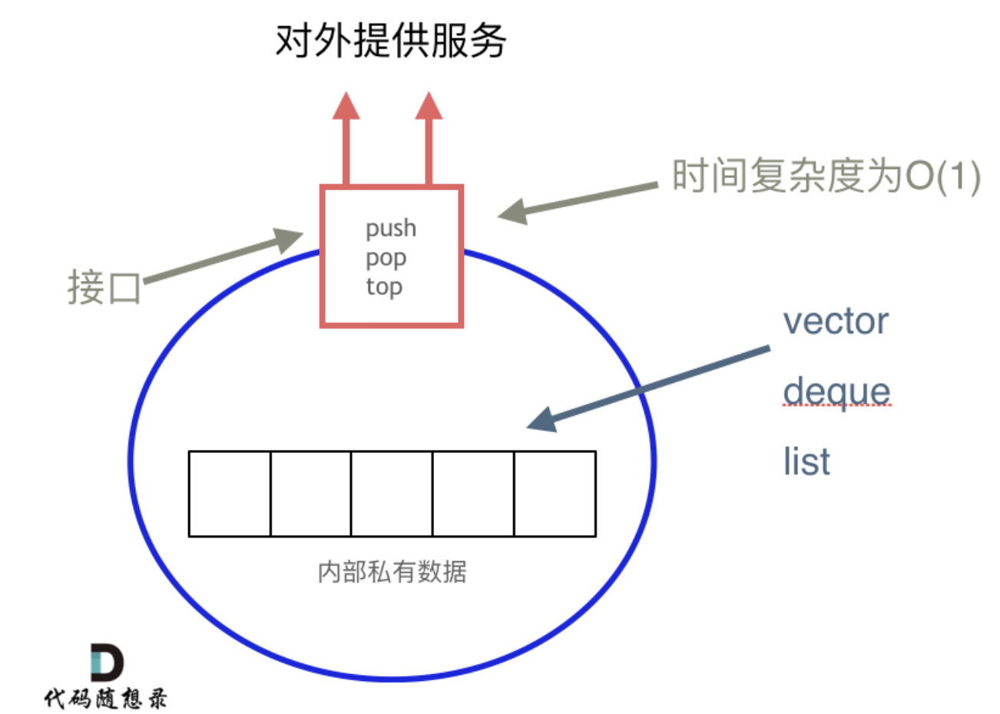

# Stack
Stack is a data structure in which the addition or removal of an element follows a particular order, i.e. LIFO (Last-In/First-Out) and FILO (First-In/Last-Out). We can implement a stack by using an array, deque, or singly linked list as long as it fulfils the interface of the stack. 

Interface of Stack:\
(1) push\
(2) pop\
(3) top
 
Unlike an array, random access is not allowed for the objects contained in the stack.

# Queue
Queue is a data structure in which addition or removal of element only follows a particular order i.e. FIFO (First-In/First-Out).

Interface of Stack:\
(1) push\
(2) pop\
(3) peek: Returns the element at the front of the queue.
 
Unlike an array, random access is not allowed for the objects contained in the stack.

# Reference
[代码随想录 - 栈](https://programmercarl.com/%E6%A0%88%E4%B8%8E%E9%98%9F%E5%88%97%E7%90%86%E8%AE%BA%E5%9F%BA%E7%A1%80.html)