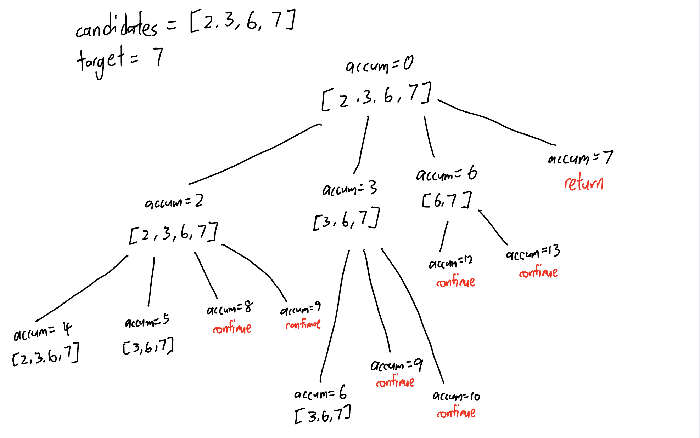
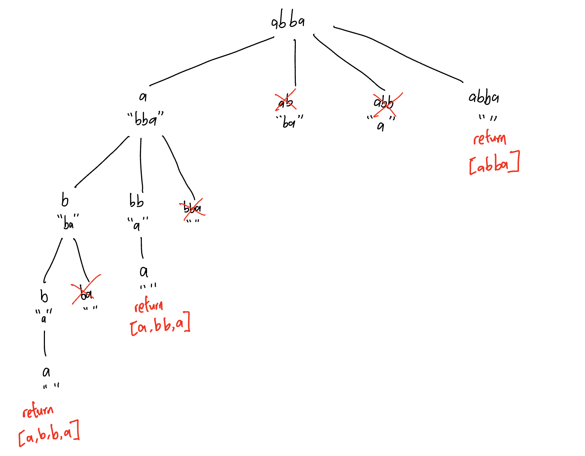

# 39. Combination Sum
  
```PYTHON
def combinationSum(self, candidates: List[int], target: int) -> List[List[int]]:
    def backtrack(accum, target, path, startIndex):
        if accum == target:
            res_list.append(path[:])
            return
        
        for i in range(startIndex, len(candidates)):
            if accum + candidates[i] > target:
                continue
            
            accum += candidates[i]
            path.append(candidates[i])
            backtrack(accum, target, path, i)
            path.pop()
            accum -= candidates[i]


    res_list = []
    backtrack(0, target, [], 0)
    return res_list
```
# 40. Combination Sum II
```PYTHON
def combinationSum2(self, candidates: List[int], target: int) -> List[List[int]]:
    def backtrack(accum, target, path, startIndex):
        if accum == target:
            res_list.append(path[:])
            return

        for i in range(startIndex, len(candidates)):
            if accum + candidates[i] > target:
                continue

            accum += candidates[i]
            path.append(candidates[i])
            backtrack(accum, target, path, i + 1)
            path.pop()
            accum -= candidates[i]

    res_list = []
    backtrack(0, target, [], 0)
    return res_list
```

# 131. Palindrome Partitioning
  
### way 1: backtracking with smaller string
```PYTHON
def partition(self, s: str) -> List[List[str]]:
    def isPalindrome(string):
        left = 0
        right = len(string) - 1
        while left <= right:
            if string[left] != string[right]:
                return False
            left += 1
            right -= 1

        return True

    def backtrack(path, s):
        if not s:
            res_list.append(path[:])
            return

        for i in range(1,len(s)+1):
            substring = s[:i]

            if not isPalindrome(substring):
                continue
            
            path.append(substring)
            backtrack(path, s[i:])
            path.pop()

    
    res_list = []
    backtrack([], s)
    return res_list
```
### way 2: backtracking with startIndex
```PYTHON
def partition(self, s: str) -> List[List[str]]:
    def isPalindrome(string):
        left = 0
        right = len(string) - 1
        while left <= right:
            if string[left] != string[right]:
                return False
            left += 1
            right -= 1

        return True

    def backtrack(path, s, startIndex):
        if startIndex >= len(s):
            res_list.append(path[:])
            return

        for i in range(startIndex, len(s)):
            substring = s[startIndex:i+1]

            if not isPalindrome(substring):
                continue
            
            path.append(substring)
            backtrack(path, s, i + 1)
            path.pop()

    
    res_list = []
    backtrack([], s, 0)
    return res_list
```