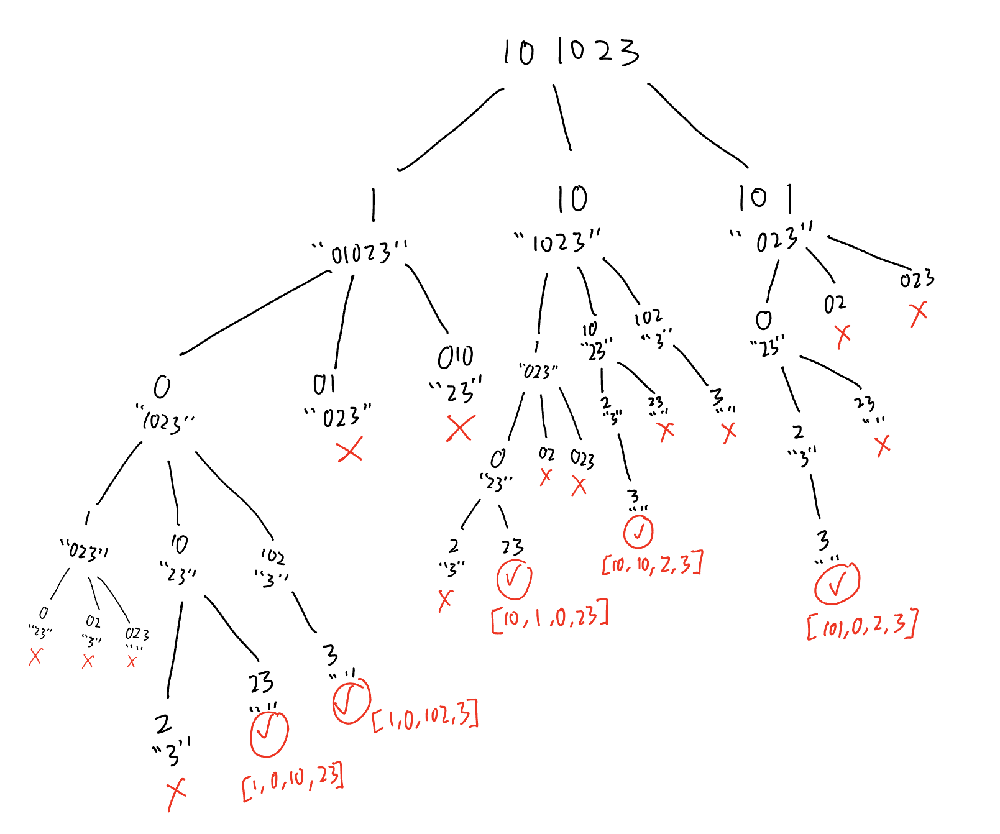

# 93. Restore IP Addresses
  
```PYTHON
def restoreIpAddresses(self, s: str) -> List[str]:
    def isValidSubIP(s):
        if len(s) > 1 and s[0] == '0':
            # detect leading zeros
            return False
        if s and int(s) > 255:
            # more than 255
            return False
        return True

    def backtrack(path, s):
        if len(s) == 0:
            if len(path) == 4:
                res_list.append(".".join(path))
            return

        lastIndex = min(4, len(s)+1)
        for i in range(1,lastIndex):
            subIP = s[:i]

            if not isValidSubIP(subIP):
                continue

            if len(path) == 4:
                continue
            
            path.append(subIP)
            backtrack(path, s[i:])
            path.pop()

    res_list = []
    backtrack([], s)
    return res_list
```
# 78. Subsets

### way 1:
```PYTHON
def subsets(self, nums: List[int]) -> List[List[int]]:
    def backtrack(startIndex, nums, path):
        res_list.append(path[:])

        if startIndex > len(nums):
            return

        for i in range(startIndex, len(nums)):
            path.append(nums[i])
            backtrack(i + 1, nums, path)
            path.pop()

    res_list = []
    backtrack(0, nums, [])
    return res_list
```
### way 2: 
```PYTHON
def subsetsWithDup(self, nums: List[int]) -> List[List[int]]:
    def backtrack(startIndex, nums, path):
        res_list.append(path[:])

        if startIndex > len(nums):
            return

        for i in range(startIndex, len(nums)):
            
            if i > startIndex and nums[i] == nums[i-1]:
                continue

            path.append(nums[i])
            backtrack(i + 1, nums, path)
            path.pop()


    res_list = []
    backtrack(0, sorted(nums), [])
    return res_list
```