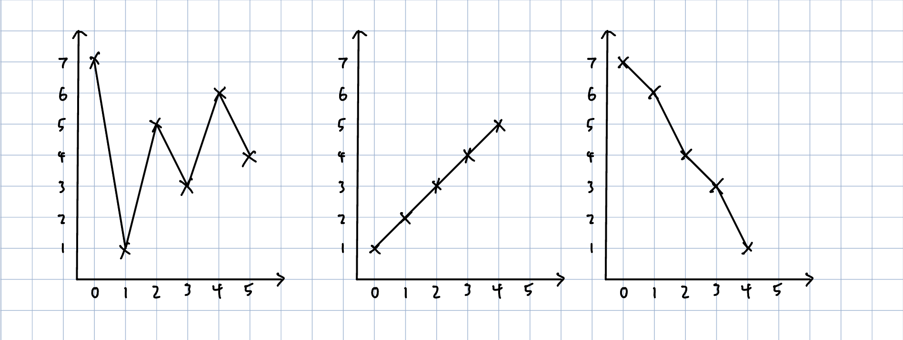
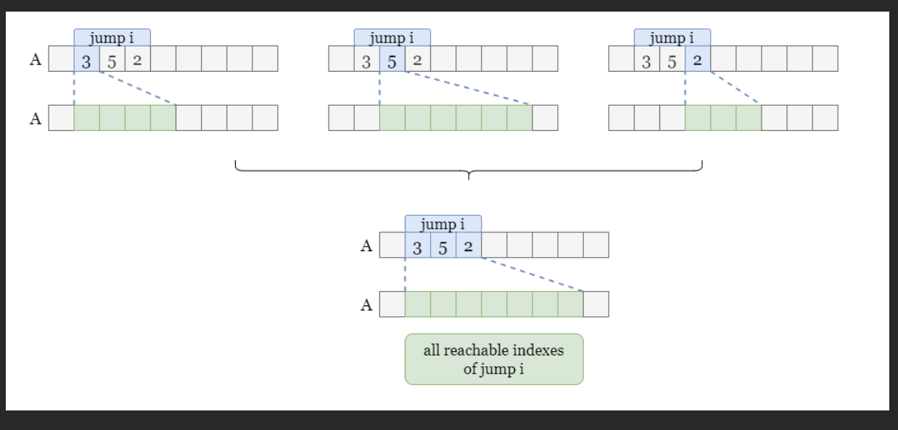

# 122. Best Time to Buy and Sell Stock II

```PYTHON
def maxProfit(self, prices: List[int]) -> int:

    profit = 0
    for i in range(1, len(prices)):
        curr_diff = prices[i] - prices[i-1]
        if curr_diff > 0:
            profit += curr_diff

    return profit
```

# 55. Jump Game
```PYTHON
def canJump(self, nums: List[int]) -> bool:
    if len(nums) == 1: return True
    
    curr = nums[0]
    for i in range(1, len(nums)):
        if curr == 0:
            return False

        curr -= 1

        if nums[i] > curr:
            curr = nums[i]

        if i + curr >= len(nums)-1:
            return True
```
# 45. Jump Game II
### way 1: 
time complexity: O(n<sup>k</sup>), where k = the minimum number of jumps to reach nums[n - 1] from nums[0]\
space complexity: O(1)
```PYTHON
def jump(self, nums: List[int]) -> int:
    if len(nums) == 1: return 0

    result = 0
    last_index = len(nums) - 1
    while last_index > nums[0]:
        for i in range(last_index + 1):
            if i + nums[i] >= last_index:
                last_index = i
                result += 1
                break

    return result + 1
```
### way 2: leetcode's greedy version
(image from leetcode)

time complexity: O(n)\
space complexity: O(1)
```PYTHON
def jump(self, nums: List[int]) -> int:
    
    result = 0
    curr_end = 0
    max_reachable_index = nums[0]
    for i in range(len(nums)-1):
        max_reachable_index = max(max_reachable_index, nums[i] + i)
        if i == curr_end:
            curr_end = max_reachable_index
            result += 1
    
    return result
```