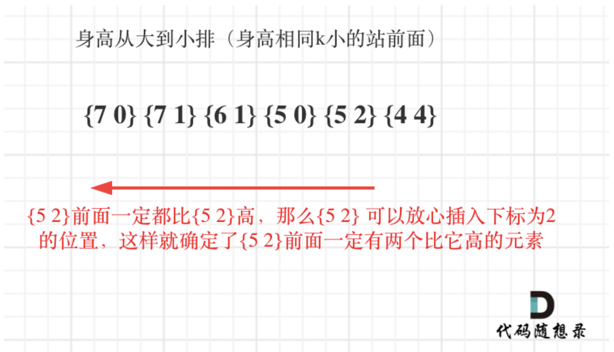
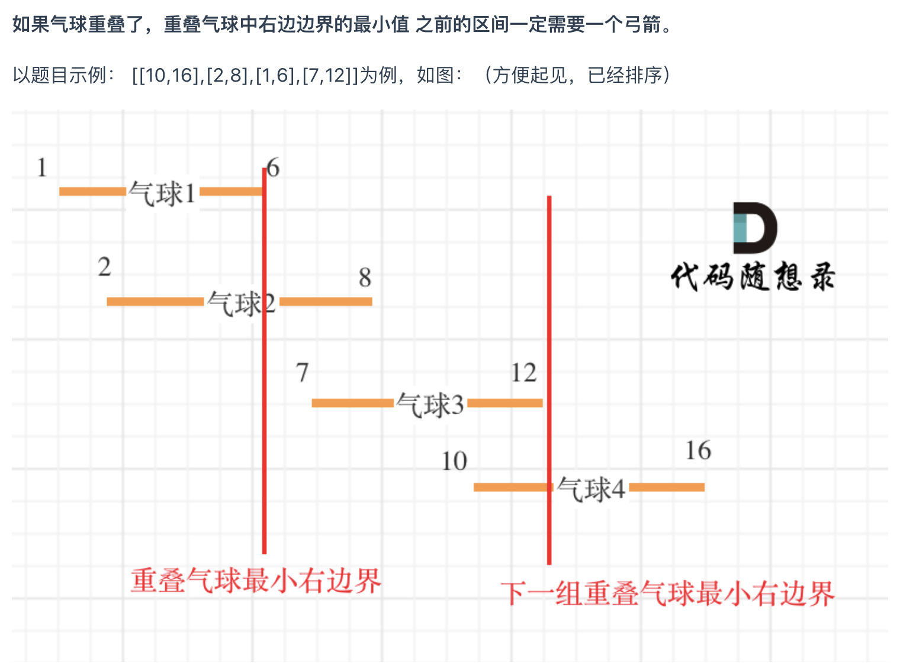

# 860. Lemonade Change
```PYTHON
def lemonadeChange(self, bills: List[int]) -> bool:
    notes = {5: 0, 10: 0, 20: 0}
    for bill in bills:
        if bill == 5:
            notes[5] += 1
        elif bill == 10:
            if notes[5] > 0:
                notes[5] -= 1
            else:
                return False
            notes[10] += 1
        else:
            if notes[10] > 0 and notes[5] > 0:
                notes[5] -= 1
                notes[10] -= 1
            elif notes[5] >= 3:
                notes[5] -= 3
            else:
                return False
            notes[20] += 1
    
    return True
```

# 406. Queue Reconstruction by Height
As `k` depends on `h`, so we sort the `people` array by `h` first (in descending order) then by `k` (in ascending order). 

```PYTHON
def reconstructQueue(self, people: List[List[int]]) -> List[List[int]]:

    queue = []
    people.sort(key= lambda x: (x[0], - x[1]), reverse = True)
    for [h,k] in people:
        queue.insert(k, [h,k])

    return queue
```

# 452. Minimum Number of Arrows to Burst Balloons

Average case time complexity: O(n log n), due to the Tim Sort (built-in sorting algorithm of python)\
Space complexity: O(1)
```PYTHON
def findMinArrowShots(self, points: List[List[int]]) -> int:
    points.sort(key= lambda x: (x[0]))
    result = 1
    for i in range(1, len(points)):
        if points[i][0] > points[i-1][1]:
            result += 1
        else:
            points[i][1] = min(points[i-1][1], points[i][1])

    return result
```
